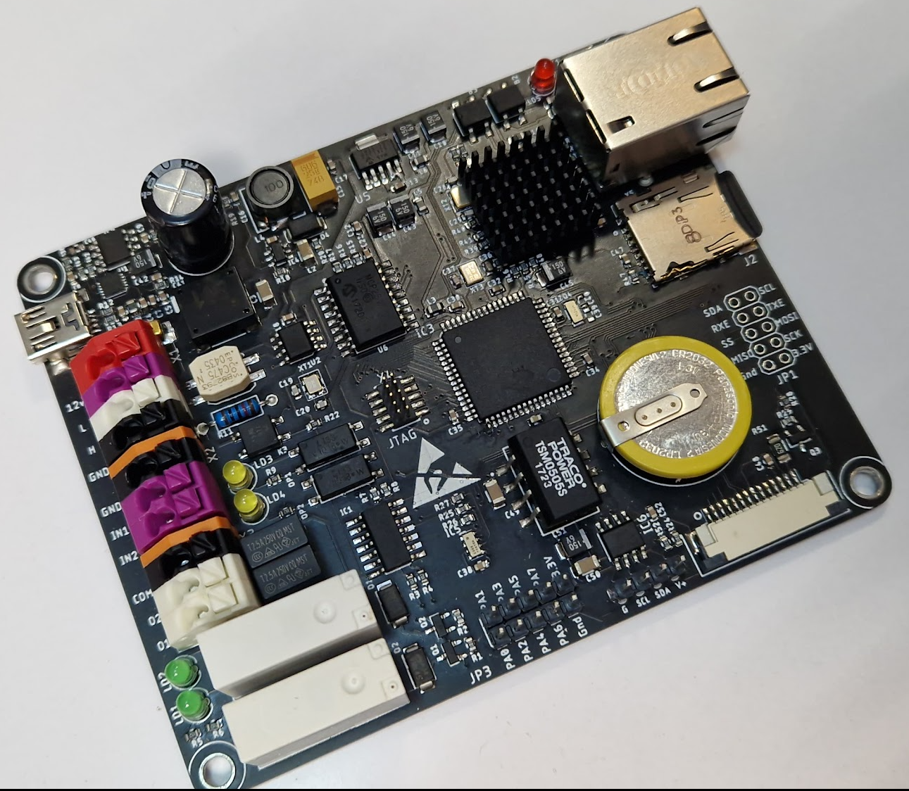
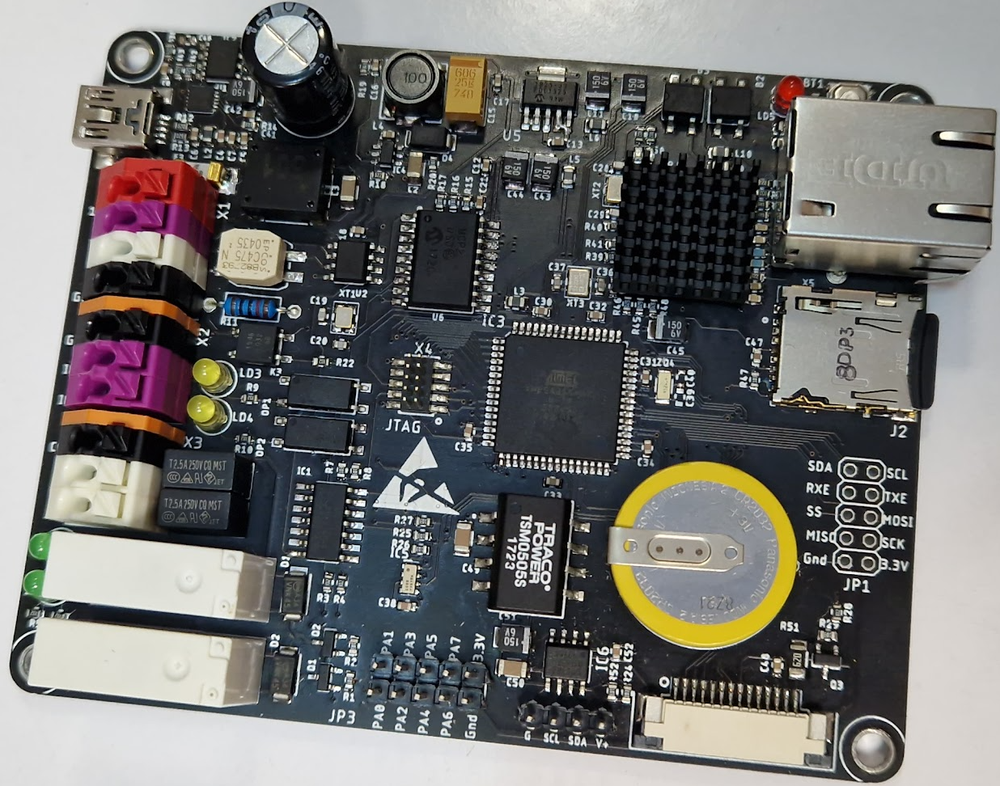

# XMEGA256A3BU_SmartHome_Gateway

## Опис проекту
Це шлюз для розумного будинку, який може з'єднувати різні типи пристроїв з різними інтерфейсами, передавати та буферизувати між ними інформацію, реалізувати власну логіку та багато іншого.

## Можливості
- Підтримка інтерфейсів: LAN, CAN, SPI, I2C, GPIO
- Релейні виходи та входи з оптичною розв'язкою
- SD карта для логів
- Веб сервер для керування

## Структура проекту
- **XMEGA_A3BU**: Основний код проекту
  - `main.c`: Головний файл програми
  - `driver/`: Драйвери для різних периферійних пристроїв
  - `libs/`: Бібліотеки для роботи з різними інтерфейсами та пристроями
- **eagle_src**: Схеми та плати проекту
  - `controller_V1.brd`: Файл плати
  - `controller_V1.sch`: Схема проекту

## Контролер
В проекті використовується контролер **XMEGA256A3BU**. Основні переваги цього контролера:
- Висока продуктивність завдяки 8/16-бітному процесору
- Велика кількість периферійних інтерфейсів
- Низьке енергоспоживання
- Вбудована підтримка USB

## Фото модуля



## Інструкції по збірці
Для збірки проекту використовуйте Makefile, який знаходиться у директорії `XMEGA_A3BU/Debug/`.

```sh
cd XMEGA_A3BU/Debug/
make